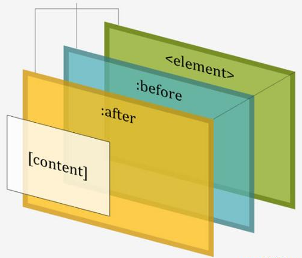
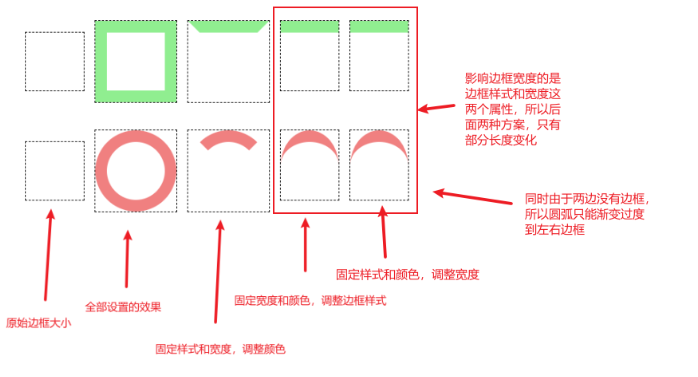
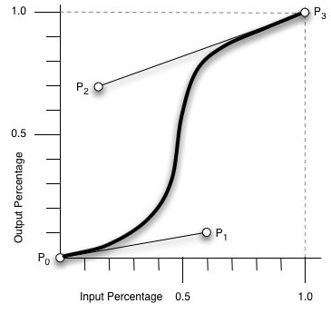

# CSS3艺术

## css基础知识

### 在页面中使用css

- 内联式
- style元素
- 外链式

### css常用属性

| 属性名           | 作用                                               |
| :--------------- | -------------------------------------------------- |
| width            | 元素宽度                                           |
| height           | 元素高度                                           |
| color            | 元素前景色                                         |
| background-color | 元素背景色                                         |
| left             | 元素左侧距离父元素左侧的位置                       |
| top              | 元素顶部距离父元素顶部的位置                       |
| right            | 元素右侧距离父元素右侧的位置                       |
| bottom           | 元素底部距离父元素底部的位置                       |
| font-family      | 字体                                               |
| font-size        | 字号                                               |
| line-height      | 行高（若文字行高与容器高度相等，则会垂直居中）     |
| text-align       | 水平对齐方式（常用属性 center）                    |
| Letter-spacing   | 文字间距                                           |
| overflow         | 设置溢出容器外的内容杨树，hidden表示隐藏容器的内容 |

### 选择器

- 标签选择器
  - 用起来简便
  - 但是在页面中往往有多个标签，容易冲突
  - 代码尽量语义化
- 类选择器
  - 为元素指定一个class属性
  - 以 .class-name的格式来选择对应的元素
- id选择器
  - 为元素指定一个唯一的id
  - 以#id的形式引用
- 后代选择器
  - 按照dom的树状结构，一层一层的选择
- 伪类选择器
  - 选择特殊位置和状态的元素
  - :first-child 和 :last-child
    - 选着第一或者最后一个元素
  - :nth-child()
    - odd选择奇数元素
    - even选择偶数元素
    - 还可以传入一个类型为 an+b 的表达式（例如1n+2）
  - :not()
    - 用于排除一些元素
  - :hover
    - 鼠标悬停的时候的状态

### 单位

- 长度
  - px
    - 一个像素点
  - em
    - 相对尺寸
    - 以font-size为基准大小
  - fr
    - 表示平分后的一份的宽度
- 颜色
  - 颜色名称
    - 例如 red green
  - hsl表示法
    - h 色相 s 饱和度 l 亮度
    - h色相 ：0° 红色，30° 橙色，60° 黄色，120° 绿色，180° 青色，240° 蓝色，300° 紫色，360° 红色
    - s饱和度 ：0%-100% 表示从纯色-灰色
    - l亮度 ：0%-100% 全黑-全白
  - rgb表示法
    - 红 绿 蓝 三色调色
  - hsla/rgba表示法
    - 加入了 a 透明的

### 盒模型

- 网页布局中，一个元素的大小，是它的content+padding+border 来算的，由此计算宽高比较麻烦
- 所以在css3中引入了box-sizing 其中 content-box 是以盒子的宽高以content的边界计算，border-box 是盒子的宽高以border的边界计算，也就是整个content+padding+border  的空间
- 使用border-box 可以定义好widih和height之后，在调整padding和border的时候，就不会再影响到盒子外面

### 定位

- 相对定位
  - position:relative
  - 以元素默认位置为起点，top left right bottom 都是以起点计算
- 绝对定位
  - position:absolute
  - 以父元素位置为起点进行计算
  - 父元素必须被定位过（相对，绝对都可）
  - 如果没有，就向上寻找祖先元素，最后还没有则以整个窗口（body）为父元素

### 布局

- flex布局

  - display: flex

  - 居中

    - align-items: center 垂直居中
    - justify-content: center 水平居中
    - 以上两个属性一起使用，就是垂直水平居中

  - 横向排列元素

    - justify-content:flex-start 居左
    - justify-content:flex-end 居右
    - justify-content:space-between 首位靠边，平铺
    - justify-content:flex-around 平铺

  - 纵向排列元素

    - 增加 flex-direc-tion: column 属性即可

  - 轴

    - flex-start和flex-end

      - 当轴是从左到右时 flex-start和flex-end 就是代表左端和右端
      - 当轴是从上到下时 flex-start和flex-end 就是代表顶部和底部

    - flex-direction

    - | 主轴方向 | flex-direction | justify-content:center | align-items:center |
      | -------- | -------------- | ---------------------- | ------------------ |
      | 从左到右 | row            | 水平居中               | 垂直居中           |
      | 从上到下 | column         | 垂直居中               | 水平居中           |

    - align-items:center 表示在交叉轴方向居中

    - justify-content:center 表示子元素在主轴方向上居中

- grid布局
  - display: grid
  - grid-template-columns用于规定每行需要多少列
  - repeat(4, 1fr)表示把一行平均分成四份
  - grid-template-columns: repeat(4, 1fr) 建立每行四个元素的矩阵 

### 重叠

- 窗口重叠

- 使用前提，需要被定位过（相对，绝对）

- z-index 代表在z轴上的次序，越接近屏幕则值越小，越远离则值越大

- 含有子元素容器之前的重叠关系

  - 当两个元素分属于不同的父元素时，虽然设置了z-index但是这个值只对相同父元素的子元素生效

- 主元素与子元素（伪元素）之间的重叠关系

  - 每个主元素有两个伪元素，::before和after元素，默认情况，主元素在最下面（绿），::before 元素在中间（黄），::after在最上面

  - 当给主元素设置z-index: auto时，并将伪元素设置为负数，则主元素在最上面（绿），::before 元素在中间（黄），::after在最下面

  - 当给主元素设置z-index: 数字 时，并将伪元素设置为负数，但主元素在最下面（绿），::before 元素在中间（黄），::after在最上面，

  - 原因，主元素和伪元素不是同级关系，之间不能比较，不论主元素值多少，都位于整个容器最下面一层

    

### 继承

- css属性中，有些属性会默认使用父元素的属性，如color属性，称为继承，但是也有些属性是不继承的，如margin
- 引用颜色
  - 关键字 currentColor 表示使用当前颜色
  - 未设置颜色时会默认使用父元素的颜色
- 引用尺寸
  - 在子元素中设置长高为父元素的百分比

## 伪元素

### ::before和::after伪元素

- 伪元素指代的是由css生成的元素，而不是DOM结构生成的元素

  

- <element>元素是由DOM结构生成的，::before和::after伪元素是由CSS生成的

- [伪元素练习]: css3练习\伪元素\伪元素.html

### content属性

- 所有伪元素都必须有content属性，即使没有引用文本，也要书写content: '' 
- [伪元素练习]: css3练习\伪元素\伪元素2.html
### 灵活使用伪元素

- 用伪元素拼接造型
  - [伪元素练习]: css3练习\伪元素\伪元素3.html

- 用主元素和伪元素拼接造型

  - [伪元素练习]: css3练习\伪元素\伪元素4.html
  
- 用伪元素表现造型

  - [伪元素练习]: css3练习\伪元素\伪元素5.html

- 用主元素和伪元素表现造型的3个部分
  - [伪元素练习]: css3练习\伪元素\伪元素6.html
  
- 用伪元素表现成对的元素

  - [伪元素练习]: css3练习\伪元素\伪元素7.html

### 项目一，蒸锅

- [伪元素练习]: css3练习\伪元素\项目一蒸锅.html

### 项目二，怪兽

- [伪元素练习]: css3练习\伪元素\项目二怪兽.html

## 边框属性

### 边框样式border-style

- 边框属性有八个属性
  - [边框练习]: css3练习\边框\边框.html

- 真正有使用价值的就是border-style: solid 和dasehd属性
  - 一个是实线，一个是虚线
- 其他几种都可以使用css实现

### 边框宽度border-width

- border-width用来设置边框的宽度啊，它接受四个长度数值，分别对应上右下左四条边的宽度
  - [边框练习]: css3练习\边框\边框宽度.html

### 边框颜色border-color

- 当没有设置边框颜色的时候，会默认使用当前元素的color属性的值
  - [边框练习]: css3练习\边框\边框颜色.html

### 分别设置每条边框

- 写法一，让边框宽度和样式保持正常，用边框颜色来控制需要哪些边框

- 写法二，让边框宽度和颜色保持正常，用边框样式来控制需要哪些边框

- 写法三，让边框颜色和样式保持正常，用边框宽度来控制需要哪些边框

  

- [边框练习]: css3练习\边框\边框设置.html

### 边框圆角border-radius

- 边框圆角border-radius属性，用于设置的是容器的圆角

- 简单示例
  - [边框练习]: css3练习\边框\边框圆角1.html

- 进阶示例

  - border-top-left-radius: 50% / 10%

  - 比正圆多了一个属性，中间用 / 分割

  - 两个值表示椭圆圆心的水平和垂直坐标

  - [边框练习]: css3练习\边框\边框圆角2.html

  - [边框练习]: css3练习\边框\边框圆角3.html

### 轮廓线outline

- 严格来说，outline不是边框属性，但其性质与边框很相似
- outline 也用于元素描边，但是其没有圆角属性，所以仅仅能回绕二级盒子进行描边
- 主要用途是作为辅助线，用来查看特殊图形所占空间的大小

- [边框练习]: css3练习\边框\轮廓线outline.html

### 描边造型

- 同心正方形
  - [边框练习]: css3练习\边框\正方形.html

- 同心圆

  - [边框练习]: css3练习\边框\圆.html

- 圆弧，wifi
  - [边框练习]: css3练习\边框\圆弧.html

### 几何造型

- 圆形
  - [边框练习]: css3练习\边框\圆形.html

- 半圆

  - [边框练习]: css3练习\边框\半圆形.html
  - [边框练习]: css3练习\边框\狐狸.html

- 扇形

  - [边框练习]: css3练习\边框\扇形.html
  - [边框练习]: css3练习\边框\鸭子.html

- 三角形

  - [边框练习]: css3练习\边框\三角形.html

  - [边框练习]: css3练习\边框\VueLogo.html

- 花	
  - [边框练习]: css3练习\边框\花.html

### 项目一： 铅笔

- [边框练习]: css3练习\边框\铅笔.html

### 项目二： 飞船

- [边框练习]: css3练习\边框\飞船.html

## 背景

### 背景颜色属性background-color

- 设置单个元素的背景颜色
  - [背景练习]: css3练习\背景\背景颜色.html

### 背景图片 backround-image

- 用于设置背景图片，图片可以是url（）指定的静态图片，也可以使用渐变函数

  - [背景练习]: css3练习\背景\背景图片.html

### 背景位置 backggground-position

- 用来设置图片再背景中的位置。分别为横纵坐标

- 属性值有三种数据类型，两个属性值，

  1. 如果忽略其中一个，则默认使用50%
  2. 位置关键字，如top.bottom,left,right,center
  3. 尺寸值，如10px，10em
  4. 百分比值，如89%

- 案例

  - [背景练习]: css3练习\背景\背景图片位置.html

### 背景尺寸 background-size

- 用于设置背景颜色的尺寸

- 属性值有三种数据类型，两个属性值，

  1. 如果忽略其中一个，则默认按照比例自动计算
  2. 尺寸值，如10px，10em
  3. 百分比值，如89%

- 案例
  - [背景练习]: css3练习\背景\背景尺寸.html

### 背景平铺 backaground-repeat

- 用于设置背景属性是否重复平铺

  - 默认值是repeat表示平铺，no-repeat 表示不平铺
  - repeat-x，repeat-y分别表示横向平铺，或者竖向平铺

- 案例
  - [背景练习]: css3练习\背景\背景平铺.html

### 线性渐变 linear-gradient()

#### 设置多个参数值

- linear-gradient 用于生成线性渐变的图片，可以接受多个参数，每个参数为一个色彩值

- 案例一
  - [背景练习]: css3练习\背景\线性渐变.html

- 案例二
  - [背景练习]: css3练习\背景\线性渐变2.html

#### 锐利的线性渐变

- 在每个位置写上两个相同的色彩值
  - [背景练习]: css3练习\背景\锐利的线性渐变.html

#### 线性渐变的角度

- 可以再渐变序列之前指定一个角度值，再0°到360°之间

- 或者可以更加语义化的方式，以 to 开头，后面接上right，left，top，bottom
  - [背景练习]: css3练习\背景\线性渐变角度.html

#### 有透明的的线性渐变

- 除了可以使用currentColor来做关键词之外，还可以使用 transparent  关键字来作为颜色
  - [背景练习]: css3练习\背景\线性渐变透明.html

### 径向渐变 radial-gradient()

#### 设置多个参数值

- 生称径向渐变的图片，可以接受多个参数，每个参数为一个色彩
  - [背景练习]: css3练习\背景\径向渐变.html

#### 锐利的径向渐变

- 在每个位置写上两个相同的色彩值
  - [背景练习]: css3练习\背景\锐利的径向渐变.html

#### 椭圆和正圆

- 径向渐变有两个独立的属性值，通过在渐变序列前增加关键字ellipse和circle,可以指定渐变是按照容器形状渐变，还是以圆形渐变，默认值为ellipse按照容器渐变
  - [背景练习]: css3练习\背景\径向渐变-椭圆和正圆.htm

#### 与透明的的径向渐变

- 除了可以使用currentColor来做关键词之外，还可以使用 transparent  关键字来作为颜色
  - [背景练习]: css3练习\背景\径向渐变透明.html

### 项目一：熊猫

- [背景练习]: css3练习\背景\panda.html

### 项目二：扫描

- [背景练习]: css3练习\背景\rader.html

## 阴影

### 盒阴影

- 每个html标记和他们的伪元素都被称之为盒子，box-shadow属性用于为这些盒子生成阴影，盒子内部叫做内容阴影，盒子外部叫做外部阴影
- 若box-shadow的偏移量为0，那么阴影就会环绕边缘进行绘制
  - [阴影练习]: css3练习\阴影\阴影.html

### 外部阴影

- 两个长度参数，表示阴影在垂直和水平的方向的偏移量

  - [阴影练习]: css3练习\阴影\外部阴影.html

- 第三个长度参数，表示阴影的模糊半径，长度越长越模糊，实际山就是设置了从阴影开始向模糊半径变色，直到变成透明色为止

  - [阴影练习]: css3练习\阴影\外部阴影1.html

- 第四个长度参数，阴影的扩散半径，阴影的大小默认就是元素的大小，扩散半径大于0则阴影越大，小于0则越小
  - [阴影练习]: css3练习\阴影\外部阴影2.html

### 内部阴影

- 用于描绘物品向外的投影

- 参数中增加了inset关键字，表示绘制内容内部阴影
  - [阴影练习]: css3练习\阴影\内部阴影.html

  - [阴影练习]: css3练习\阴影\内部阴影1.html

### 多重阴影

- 和background类似，box-shadow也可以用来接收多个参数，渲染多重阴影，各组参数之间用逗号隔开
  - [阴影练习]: css3练习\阴影\内部阴影2.html

### 复制自身的阴影

- 如果box-shadow的偏移量比元素本身还大，那么阴影就会绘制在元素之外，不在与元素重叠，这样就获得了和元素等大的新元素，再结合扩散半径参数，九年获得和元素形状相同且尺寸成比例的元素
  - [阴影练习]: css3练习\阴影\复制阴影.html

### 形状阴影函数 drop-shadow()

- 形状阴影函数 drop-shadow是一种滤镜

- drop-shadow 和 box-shadow 的区别在于，box-shadow只能绘制一个元素的阴影，而dorp-shadow可以绘制一个容器内多个元素形成图案的阴影

  - [阴影练习]: css3练习\边框\铅笔.html

- drop-shadow函数接收四个参数，水平偏移量，垂直偏移量，模糊半径，颜色，同时也少了inset属性和扩散半径，也就是说不能用其绘制内阴影，阴影的尺寸也要和本体保持一致
  - [阴影练习]: css3练习\阴影\形状阴影函数.html

### 项目一：日历

- [阴影练习]: css3练习\阴影\calendar.html

项目二：飞机舷窗

- [阴影练习]: css3练习\阴影\window.html

## 剪切，滤镜和色彩混合

### 剪切 clip-path

- clip-path属性用于在元素内创建一个剪切区域，区域外部将被隐藏，仅仅显示区域内的部分，可以利用几个函数绘制出矩形、圆形、椭圆形和任意多边形的剪切区域

#### 矩形剪切 inset()

- inset() 函数接收4个长度参数，分别为top、right、bottom、left

  - [剪切练习]: css3练习\剪切，滤镜和色彩混合\矩形剪切.html

  - [剪切练习]: css3练习\剪切，滤镜和色彩混合\矩形剪切2.html

#### 圆形剪切 circle()

- circle() 函数接收两个参数，一个代表圆的半径，第二个参数表示圆形所在的位置，以at开团
  - [剪切练习]: css3练习\剪切，滤镜和色彩混合\圆形剪切.html

#### 椭圆形剪切 ellipse()

- ellipse() 函数接收 3 个参数，分别是椭圆的水平半径，垂直半径和圆心位置
  - [剪切练习]: css3练习\剪切，滤镜和色彩混合\椭圆剪切.html

#### 多边形剪切 polygon()

- 可以写多个元素，即多个坐标点位
  - [剪切练习]: css3练习\剪切，滤镜和色彩混合\多边形剪切.html

  - [剪切练习]: css3练习\剪切，滤镜和色彩混合\多边形剪切2.html

### 滤镜 filter

- 滤镜的多个函数能从颜色、模糊的、亮度等多个角度修改元素的视觉效果

#### 透明度滤镜 opacity()

- opacity()函数接收的参数值是一个从0-1之间的树脂，0表示完全透明，1表示不透明
- [滤镜练习]: css3练习\剪切，滤镜和色彩混合\透明度滤镜.html

#### 模糊滤镜 blur()

- blur() 函数就收的参数是一个长度值，表示模糊半径，是对整个元素进行操作
  - [滤镜练习]: css3练习\剪切，滤镜和色彩混合\模糊滤镜.html

#### 色相滤镜 hue-rotate

- hue-rotate() 函数接收一个角度值作为参数，它的含义是将色相环旋转多少度，此值可正可负，正值表示沿色相环顺时针方向寻找色值，负值则表示沿色相环逆时针方向寻找色值
  - [滤镜练习]: css3练习\剪切，滤镜和色彩混合\色相滤镜.html

#### 亮度滤镜 brightness

- brightness() 函数接收一个数值或百分比值作为参数，表示相对于当前的亮度（当前亮度为1和100%）的变化成度，若值大于1则元素变亮，若值小于1，则元素变暗
  - [滤镜练习]: css3练习\剪切，滤镜和色彩混合\亮度滤镜.html

  - [滤镜练习]: css3练习\剪切，滤镜和色彩混合\亮度滤镜2.html

#### 对比度滤镜 contrast()

- constrast() 函数接收一个数值或百分比值作为参数，表示当前的对比度，若大于1则对比度变高，若小于1，则对比度更低

- 对比度比值越大，则颜色越白越黑，对比度越小，则颜色越灰
  - [滤镜练习]: css3练习\剪切，滤镜和色彩混合\对比度滤镜.html

  - [滤镜练习]: css3练习\剪切，滤镜和色彩混合\对比度滤镜2.html

#### 多重滤镜

- 可以在一个filter属性中同时应用多个滤镜，多个函数之间用空格来分隔
  - [滤镜练习]: css3练习\剪切，滤镜和色彩混合\多重滤镜.html

### 色彩混合

- 颜色混合模式 mix-blend-mode 用于将两个图层的颜色融合在一起，混合的模式一共有16种，但是它们大多是对色值的数值运算

#### multiply 模式

- multply 模式类似于用染料绘画的效果，拿多支笔在纸上画画，它们的颜色重叠效果就是multiply模式，突出合成之后的颜色通常比参加合成的颜色要深。如果参加合成之一是白色，则合成色为另外一个突出颜色，如果参与合成的图层之一就是黑色则合成色是黑色
  - [色彩混合练习]: css3练习\剪切，滤镜和色彩混合\multiply模式.html

#### screen模式

- screen 模式类类似把多束光纤投影到屏幕上的效果，如果参加合成之一是白色，则合成色为白色，如果参与合成的图层之一就是黑色则合成色是另外一个图层颜色

  - [色彩混合练习]: css3练习\剪切，滤镜和色彩混合\screen模式.html

#### difference模式

- 在difference模式下，一个图层的白色比分会合成为另外一个图层的反色，黑色部分则保留另外一个图层本身的颜色
  - [色彩混合练习]: css3练习\剪切，滤镜和色彩混合\difference模式.html

#### color-dodge模式

- 一个图层的白色部分会加亮另一个图层，黑色部分合成为另一个图层本身的颜色
  - [色彩混合练习]: css3练习\剪切，滤镜和色彩混合\color-dodge模式.html

### 项目一

- [练习]: css3练习\剪切，滤镜和色彩混合\项目一.html

### 项目二

- [练习]: css3练习\剪切，滤镜和色彩混合\项目二.html

## 变量和计数器

### 变量

#### 声明和引用变量

- 变量使用两条短横线--声明，如“-color.deepskyblue”,即声明了一个名为--color的变量，它的值为deepskybule，和样式类名一样，变量名区分大小写
  - [变量练习]: css3练习\变量和计数器\声明和引用变量.html

  - [变量练习]: css3练习\变量和计数器\声明和引用变量2.html

  - [变量练习]: css3练习\变量和计数器\项目和引用变量3.html	"、"

#### 表达式

- 表达式不能直接写出，必须放在calc()函数中，写作calc(5em * 2)
  - [变量练习]: css3练习\变量和计数器\表达式.html

  - [变量练习]: css3练习\变量和计数器\表达式2.html

  - [变量练习]: css3练习\变量和计数器\表达式3.html

#### 批量描述一组元素

- [变量练习]: css3练习\变量和计数器\批量1.html

- [变量练习]: css3练习\变量和计数器\批量2.html

- [变量练习]: css3练习\变量和计数器\批量3.html

### 计数器

#### 计数器的声明、累加和读取

- 计数器包含3个语句：定义计数器counter-reset、计数器叠加counter=increment、读取计数器的值content:counter(n)
  - [计数器练习]: css3练习\变量和计数器\计数器.html

#### 计数器的初始值和步长

- 变量声明预计counter-reset的声明默认效果为0，但是外面可以设置计数器的初始值
  - [计数器练习]: css3练习\变量和计数器\计数器的初始值.html

#### 计数器的序列

- 可以是罗马文字，繁中，简中，日文，韩文
  - [计数器练习]: css3练习\变量和计数器\计数器的序列.html

- 用计数器设计一个字母表
  - [计数器练习]: css3练习\变量和计数器\计数器的序列2html

### 项目一

[练习]: css3练习\变量和计数器\eye.html

### 项目二

[练习]: css3练习\变量和计数器\cranse.html

## 变换

### 变换函数

#### 平移函数 translate()

- 水平平移是translateX(),垂直平移是translateY()

- translate的参数值可以是正数和负数。如果是正数，则x向右移，y向上移，负值则相反

  - [变换练习]: css3练习\变换\平移函数.html

  - [变换练习]: css3练习\变换\平移函数2.html

  - [变换练习]: css3练习\变换\平移函数3.html

- 如果xy同时使用时可以使用简写 transFrom: translate(1em,2em)

  - [变换练习]: css3练习\变换\平移函数4.html

#### 旋转函数 rotate()

- 用于旋转元素，它接收一个角度值作为参数，表示元素旋转的角度，角度值为正则顺时针运作，反之则逆时针运转，话可以接收trun作为阐述1trun为一圈
  - [变换练习]: css3练习\变换\旋转函数.html

  - [变换练习]: css3练习\变换\选抓函数2.html

#### 缩放函数 scale()

- 缩放可以沿着x轴和y轴进行
  - [变换练习]: css3练习\变换\缩放函数.html

  - [变换练习]: css3练习\变换\缩放函数2.html

  - [变换练习]: css3练习\变换\缩放函数3.html

#### 扭曲函数 skew()

- 可以将矩形元素再x和y轴上进行扭曲，把矩形扭曲成平行四边形
  - [变换练习]: css3练习\变换\扭曲函数.html

  - [变换练习]: css3练习\变换\扭曲函数2.html

  - [变换练习]: css3练习\变换\扭曲函数3.html

#### 变换原点 transform-origin

- 变换时，默认是以元素的中心为原点，也可以改变原点的位置，四种变换属性中，translate平移变换与原点没有关系，所以原点变换不会影响效果，其他变换都受原点的影响
  
- 可以传入两个参数，如果只有一个参数则另外一个默认为center
  
  - [变换练习]: css3练习\变换\变换原点.html

- 有时多个元素会共享同一个变换原点
  - [变换练习]: css3练习\变换\变换原点2.html

  - [变换练习]: css3练习\变换\变换原点3.html

#### 多重变换

- 类似background-image可以设置多个图案作为背景，box-shadow也可以设置多个阴影，transform可以设置多种变换效果
  - [变换练习]: css3练习\变换\多重变换.html

  - [变换练习]: css3练习\变换\多重变换2.html

  - [变换练习]: css3练习\变换\多重变换3.html

  - [变换练习]: css3练习\变换\多重变换4.html

### 项目1

- [练习]: css3练习\变换\项目一.html

### 项目2

- [练习]: css3练习\变换\项目二.html

## 缓动

### 缓动属性

#### 持续时长transition-duration

- 属性值是一个时间单位，可以是表示秒的s和表示毫秒的ms
  - [缓动练习]: css3练习\缓动\持续时长.html

#### 延时启动时长transition-delay

- 属性值是一个时间单位，可以是表示秒的s和表示毫秒的ms
  - [缓动练习]: css3练习\缓动\延时启动时长.html

#### 参与缓动的属性transition-property

- 缓动可以让多个属性同时发生变化，transition-property属性可以指定那些属性可以参与缓动

- 主要用来配套使用，可以控制动画的速度

  - [缓动练习]: css3练习\缓动\参与缓动的属性.html

#### 时间函数transition-timing-function

- 描述了元素从一个状态到另外一个状态变化过程中的变化速度

  - [缓动练习]: css3练习\缓动\时间函数.html

- 属性值可以是内置时间函数，分别是ease（先快后慢）,linear（匀速）,ease-in（先慢后快）,ease-out（先快后慢），ease-in-out（两头慢中间快）

- 若内置的时间函数不满足要求，那么也可以使用cubic-bezier(p0 , p1 , p2 , p3)函数自定义贝塞尔曲线，取值范围如下

  - 
  - P0：默认值 (0, 0) 
  - P1：动态取值 (x1, y1)
  - P2：动态取值 (x2, y2)
  - P3：默认值 (1, 1)

- 也可以使用steps( ) 时间函数，定义多长时间执行一步

  - [缓动练习]: css3练习\缓动\时间函数2.html

### 设置恢复效果

- transition包含了两个动画过程，初始状态到终止状态的动画和从终止状态到初始状态的动画

- 默认情况下，如果元素的初始状态设置了transition属性，那么它的终止状态将获得和初始状态同样的动画效果，若终止状态设置缓动效果，初始状态则不会获得此效果
  - [缓动练习]: css3练习\缓动\设置恢复效果.html

#### 令一组元素缓动

- [缓动练习]: css3练习\缓动\令一组元素缓动.html

### 对元素不同状态的交互设计

- 页面中表单空间具有较多状态，css伪类选择器可以指定这些状态的样式，例如:focus表示获取焦点，:checked表示单选或者多选，:target表示跳转到页面内指定位置，而transition可以处理两种状态之间的缓动效果

#### 获取焦点:focus

- [缓动练习]: css3练习\缓动\focus.html

#### 选择选项:checked

- [缓动练习]: css3练习\缓动\checked.html

#### 页面跳转:target

- [缓动练习]: css3练习\缓动\target.html

### 项目一

- [缓动练习]: css3练习\缓动\rainbow.html

### 项目二

- [缓动练习]: css3练习\缓动\时间函数.html

