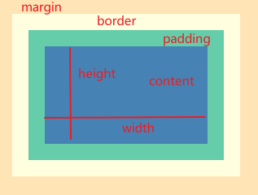
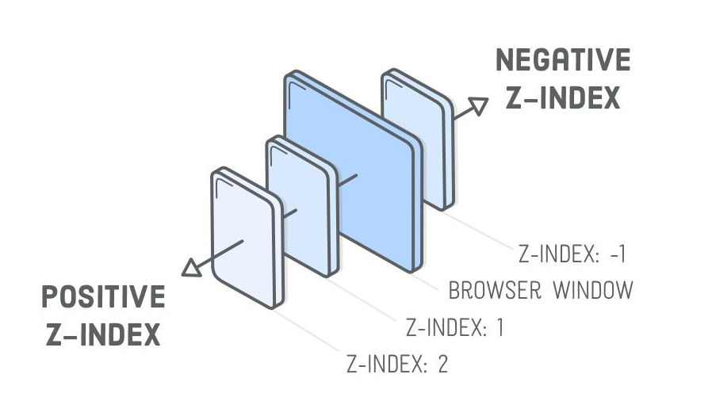
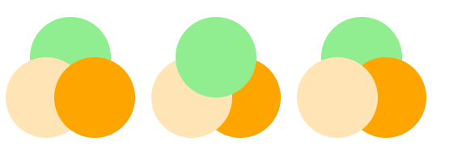

# CSS3艺术

## css基础知识

### 在页面中使用css

- 内联式
- style元素
- 外链式

### css常用属性

| 属性名           | 作用                                               |
| :--------------- | -------------------------------------------------- |
| width            | 元素宽度                                           |
| height           | 元素高度                                           |
| color            | 元素前景色                                         |
| background-color | 元素背景色                                         |
| left             | 元素左侧距离父元素左侧的位置                       |
| top              | 元素顶部距离父元素顶部的位置                       |
| right            | 元素右侧距离父元素右侧的位置                       |
| bottom           | 元素底部距离父元素底部的位置                       |
| font-family      | 字体                                               |
| font-size        | 字号                                               |
| line-height      | 行高（若文字行高与容器高度相等，则会垂直居中）     |
| text-align       | 水平对齐方式（常用属性 center）                    |
| Letter-spacing   | 文字间距                                           |
| overflow         | 设置溢出容器外的内容杨树，hidden表示隐藏容器的内容 |

### 选择器

- 标签选择器
  - 用起来简便
  - 但是在页面中往往有多个标签，容易冲突
  - 代码尽量语义化
- 类选择器
  - 为元素指定一个class属性
  - 以 .class-name的格式来选择对应的元素
- id选择器
  - 为元素指定一个唯一的id
  - 以#id的形式引用
- 后代选择器
  - 按照dom的树状结构，一层一层的选择
- 伪类选择器
  - 选择特殊位置和状态的元素
  - :first-child 和 :last-child
    - 选着第一或者最后一个元素
  - :nth-child()
    - odd选择奇数元素
    - even选择偶数元素
    - 还可以传入一个类型为 an+b 的表达式（例如1n+2）
  - :not()
    - 用于排除一些元素
  - :hover
    - 鼠标悬停的时候的状态

### 单位

- 长度
  - px
    - 一个像素点
  - em
    - 相对尺寸
    - 以font-size为基准大小
  - fr
    - 表示平分后的一份的宽度
- 颜色
  - 颜色名称
    - 例如 red green
  - hsl表示法
    - h 色相 s 饱和度 l 亮度
    - h色相 ：0° 红色，30° 橙色，60° 黄色，120° 绿色，180° 青色，240° 蓝色，300° 紫色，360° 红色
    - s饱和度 ：0%-100% 表示从纯色-灰色
    - l亮度 ：0%-100% 全黑-全白
  - rgb表示法
    - 红 绿 蓝 三色调色
  - hsla/rgba表示法
    - 加入了 a 透明的

### 盒模型

- 网页布局中，一个元素的大小，是它的content+padding+border 来算的，由此计算宽高比较麻烦
- 所以在css3中引入了box-sizing 其中 content-box 是以盒子的宽高以content的边界计算，border-box 是盒子的宽高以border的边界计算，也就是整个content+padding+border  的空间
- 使用border-box 可以定义好widih和height之后，在调整padding和border的时候，就不会再影响到盒子外面

### 定位

- 相对定位
  - position:relative
  - 以元素默认位置为起点，top left right bottom 都是以起点计算
- 绝对定位
  - position:absolute
  - 以父元素位置为起点进行计算
  - 父元素必须被定位过（相对，绝对都可）
  - 如果没有，就向上寻找祖先元素，最后还没有则以整个窗口（body）为父元素

### 布局

- flex布局

  - display: flex

  - 居中

    - align-items: center 垂直居中
    - justify-content: center 水平居中
    - 以上两个属性一起使用，就是垂直水平居中

  - 横向排列元素

    - justify-content:flex-start 居左
    - justify-content:flex-end 居右
    - justify-content:space-between 首位靠边，平铺
    - justify-content:flex-around 平铺

  - 纵向排列元素

    - 增加 flex-direc-tion: column 属性即可

  - 轴

    - flex-start和flex-end

      - 当轴是从左到右时 flex-start和flex-end 就是代表左端和右端
      - 当轴是从上到下时 flex-start和flex-end 就是代表顶部和底部

    - flex-direction

    - | 主轴方向 | flex-direction | justify-content:center | align-items:center |
      | -------- | -------------- | ---------------------- | ------------------ |
      | 从左到右 | row            | 水平居中               | 垂直居中           |
      | 从上到下 | column         | 垂直居中               | 水平居中           |

    - align-items:center 表示在交叉轴方向居中

    - justify-content:center 表示子元素在主轴方向上居中

- grid布局
  - display: grid
  - grid-template-columns用于规定每行需要多少列
  - repeat(4, 1fr)表示把一行平均分成四份
  - grid-template-columns: repeat(4, 1fr) 建立每行四个元素的矩阵 

### 重叠

- 窗口重叠

- 使用前提，需要被定位过（相对，绝对）

- z-index 代表在z轴上的次序，越接近屏幕则值越小，越远离则值越大

- 含有子元素容器之前的重叠关系

  - 当两个元素分属于不同的父元素时，虽然设置了z-index但是这个值只对相同父元素的子元素生效

- 主元素与子元素（伪元素）之间的重叠关系

  - 每个主元素有两个伪元素，::before和after元素，默认情况，主元素在最下面（绿），::before 元素在中间（黄），::after在最上面

  - 当给主元素设置z-index: auto时，并将伪元素设置为负数，则主元素在最上面（绿），::before 元素在中间（黄），::after在最下面

  - 当给主元素设置z-index: 数字 时，并将伪元素设置为负数，但主元素在最下面（绿），::before 元素在中间（黄），::after在最上面，

  - 原因，主元素和伪元素不是同级关系，之间不能比较，不论主元素值多少，都位于整个容器最下面一层

    

### 继承

- css属性中，有些属性会默认使用父元素的属性，如color属性，称为继承，但是也有些属性是不继承的，如margin
- 引用颜色
  - 关键字 currentColor 表示使用当前颜色
  - 未设置颜色时会默认使用父元素的颜色
- 引用尺寸
  - 在子元素中设置长高为父元素的百分比